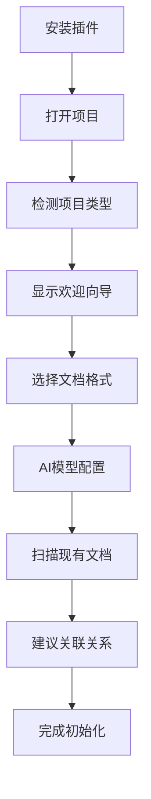
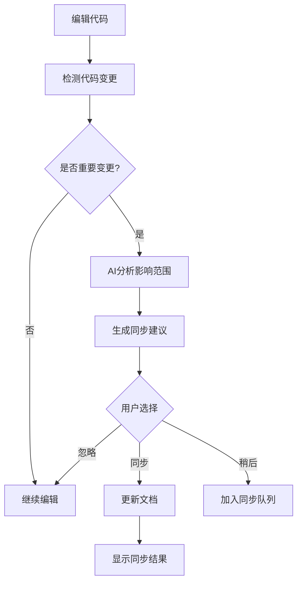

# PRD文档：IDE双空间智能管理插件

## 1. 项目概述

### 1.1 产品愿景
构建一个AI驱动的IDE插件，为每个项目提供代码空间和文档空间的智能双空间管理，通过深度集成现有IDE（VSCode、Cursor等）实现代码与文档的无缝协同，提升开发效率和文档质量。

### 1.2 产品定位
- **产品类型**：IDE插件/扩展
- **目标市场**：开发者工具市场
- **竞争优势**：AI驱动的智能关联、原生IDE集成、零学习成本

## 2. 需求分析

### 2.1 用户需求描述
**核心痛点：**
- 代码和文档分离管理，缺乏有效关联
- 代码变更后文档更新不及时，导致不一致
- 需要在多个工具间切换，影响开发效率
- 文档撰写质量参差不齐，缺乏标准化

**期望解决方案：**
- 在熟悉的IDE环境中实现代码文档一体化管理
- AI自动识别代码变更并智能提示文档更新
- 双向关联系统，支持从文档快速定位到代码
- 利用AI大模型能力提升文档撰写质量

### 2.2 目标用户群体
**主要用户：**
- 个人开发者（提高个人项目文档化水平）
- 技术团队Leader（统一团队文档标准）
- 开源项目维护者（改善项目文档质量）

**次要用户：**
- 技术写作者（代码文档专业撰写）
- 项目经理（项目文档管理）
- 新手开发者（学习规范化开发）

### 2.3 使用场景
1. **日常开发场景**：开发者编写代码时实时生成和更新文档
2. **代码重构场景**：重构代码后批量更新相关文档
3. **项目交接场景**：快速生成项目完整文档
4. **代码review场景**：检查代码文档一致性
5. **开源贡献场景**：为开源项目贡献高质量文档

## 3. 产品目标

### 3.1 业务目标
- **短期目标（6个月）**：插件安装量达到10,000+，月活用户5,000+
- **中期目标（1年）**：支持5种主流编程语言，企业用户100+
- **长期目标（2年）**：成为开发者必备工具，建立商业化模式

### 3.2 用户价值目标
- 提升文档撰写效率50%以上
- 减少代码文档不一致问题80%
- 降低新人学习项目成本30%
- 提高代码可维护性和团队协作效率

## 4. 功能规格说明

### 4.1 核心功能模块

#### 4.1.1 双空间架构
**功能描述：** 在IDE中创建代码空间和文档空间的统一视图

**详细规格：**
```
功能点1：分屏视图管理
- 支持左右分屏、上下分屏布局
- 自适应窗口大小调整
- 支持全屏模式切换
- 保存用户布局偏好设置

功能点2：文件系统集成
- 虚拟文档文件系统
- 支持.md、.rst、.adoc等文档格式
- 文档文件自动归类和组织
- 支持文档模板系统

功能点3：工作区状态同步
- 跨会话保持双空间状态
- 支持多项目工作区切换
- 实时保存编辑状态
```

**验收标准：**
- ✅ 用户可以在1秒内切换双空间视图
- ✅ 支持同时打开10个以上文件而不卡顿
- ✅ 重启IDE后保持上次的布局设置

#### 4.1.2 智能关联系统
**功能描述：** AI驱动的代码文档智能关联和映射

**详细规格：**
```
功能点1：自动关联识别
- 基于函数/类名智能匹配文档
- 分析代码注释建立映射关系
- 识别代码结构变化影响的文档范围
- 支持自定义关联规则配置

功能点2：手动关联管理
- 拖拽建立代码文档关联
- 支持一对多、多对一关联关系
- 关联关系可视化展示
- 批量关联操作支持

功能点3：关联数据存储
- 项目级别的关联配置文件
- Git友好的配置文件格式
- 支持关联关系导入导出
- 关联历史记录和回滚
```

**验收标准：**
- ✅ AI自动识别准确率达到85%以上
- ✅ 手动建立关联操作不超过3步
- ✅ 支持1000+文件的大型项目关联管理

#### 4.1.3 实时同步引擎
**功能描述：** 代码变更与文档更新的智能同步机制

**详细规格：**
```
功能点1：变更检测
- 实时监听代码文件变化
- 智能判断变更影响范围
- 支持批量变更合并处理
- 可配置的变更敏感度

功能点2：同步策略
- 自动同步模式（实时更新）
- 提醒同步模式（用户确认）
- 手动同步模式（按需触发）
- 批量同步模式（定时处理）

功能点3：冲突解决
- 检测同步冲突并提示
- 提供merge工具解决冲突
- 支持历史版本回滚
- 冲突解决日志记录
```

**验收标准：**
- ✅ 代码变更后2秒内完成同步检测
- ✅ 同步成功率达到95%以上
- ✅ 冲突检测准确率达到90%以上

#### 4.1.4 AI智能助手
**功能描述：** 集成多种AI模型提供智能文档生成和代码分析

**详细规格：**
```
功能点1：本地AI能力
- 代码补全和语法检查
- 快速文档片段生成
- 本地隐私保护模式
- 轻量级模型部署

功能点2：云端AI能力
- 完整文档生成（README、API文档）
- 代码架构分析和可视化
- 智能代码优化建议
- 多语言翻译支持

功能点3：AI服务管理
- 多AI供应商支持（OpenAI、Claude、Cursor等）
- API密钥管理和配额监控
- AI服务负载均衡
- 自定义Prompt模板
```

**验收标准：**
- ✅ 本地AI响应时间<1秒
- ✅ 云端AI响应时间<10秒
- ✅ AI生成内容准确性>80%

### 4.2 次要功能模块

#### 4.2.1 协作功能
- 实时协作编辑支持
- 评论和讨论系统
- 变更通知和订阅
- 团队配置同步

#### 4.2.2 版本管理
- Git集成的版本控制
- 文档变更历史记录
- 分支间文档同步
- 版本对比和差异分析

#### 4.2.3 导出和集成
- 多格式文档导出（HTML、PDF、Word）
- CI/CD流水线集成
- 静态站点生成器兼容
- API文档自动生成

## 5. 技术架构设计

### 5.1 整体架构
```
┌─────────────────────────────────────────┐
│                IDE插件层                  │
├─────────────────────────────────────────┤
│  VSCode扩展    │  Cursor扩展  │  其他IDE   │
├─────────────────────────────────────────┤
│                核心引擎层                 │
├─────────────────────────────────────────┤
│  关联管理  │  同步引擎  │  AI服务  │  存储  │
├─────────────────────────────────────────┤
│                基础设施层                 │
├─────────────────────────────────────────┤
│   文件系统   │   网络层   │   配置管理     │
└─────────────────────────────────────────┘
```

### 5.2 技术选型
- **插件开发**：TypeScript + IDE Extension API
- **核心引擎**：Node.js + TypeScript
- **AI集成**：OpenAI SDK、Anthropic SDK、本地模型
- **数据存储**：本地JSON + SQLite（可选）
- **文件格式**：Markdown、JSON、YAML

### 5.3 关键技术方案

#### 5.3.1 虚拟文件系统
```typescript
interface VirtualFileSystem {
  readFile(uri: URI): Promise<Uint8Array>;
  writeFile(uri: URI, content: Uint8Array): Promise<void>;
  watchFile(uri: URI): FileWatcher;
  listFiles(directory: URI): Promise<FileInfo[]>;
}

class DualSpaceVFS implements VirtualFileSystem {
  private codeSpace: CodeSpaceProvider;
  private docSpace: DocumentSpaceProvider;
  
  async readFile(uri: URI): Promise<Uint8Array> {
    if (uri.scheme === 'dual-doc') {
      return this.docSpace.readDocument(uri.path);
    }
    return this.codeSpace.readCode(uri.path);
  }
}
```

#### 5.3.2 关联引擎
```typescript
interface AssociationEngine {
  createAssociation(code: CodeElement, doc: DocumentElement): Association;
  findAssociations(element: Element): Association[];
  validateAssociation(association: Association): ValidationResult;
}

class AIAssociationEngine implements AssociationEngine {
  private aiService: AIService;
  
  async suggestAssociations(codeFile: string): Promise<Association[]> {
    const analysis = await this.analyzeCodeStructure(codeFile);
    return this.aiService.suggestDocumentMappings(analysis);
  }
}
```

#### 5.3.3 同步引擎
```typescript
interface SyncEngine {
  sync(source: Element, target: Element): Promise<SyncResult>;
  detectChanges(element: Element): ChangeDetection;
  resolveSyncConflict(conflict: SyncConflict): Promise<Resolution>;
}

class IntelligentSyncEngine implements SyncEngine {
  async sync(source: CodeElement, target: DocElement): Promise<SyncResult> {
    const changes = this.detectChanges(source);
    if (changes.significant) {
      const aiUpdate = await this.aiService.generateDocUpdate(changes);
      return this.applyUpdate(target, aiUpdate);
    }
    return { status: 'no-change' };
  }
}
```

## 6. 用户界面设计

### 6.1 主要界面

#### 6.1.1 双空间主视图
```
┌─────────────────────────────────────────────────────────┐
│ 文件 编辑 查看 双空间 帮助                    [设置] [AI]  │
├─────────────────────────────────────────────────────────┤
│                                                         │
│  ┌─────────代码空间──────────┐ ┌─────────文档空间───────┐ │
│  │// main.js               │ │# API 文档              │ │
│  │function getUserData() { │ │                       │ │
│  │  /** @doc api.md */    │ │## getUserData()      │ │
│  │  return fetch('/user');│ │获取用户数据的函数        │ │
│  │}                      │ │                       │ │
│  │                       │ │### 参数               │ │
│  │[关联: api.md#getUserData]│ │无                    │ │
│  │                       │ │                       │ │
│  └─────────────────────────┘ └─────────────────────────┘ │
│                                                         │
│ 状态：✅ 已同步    关联：3个    AI：就绪    [立即同步]      │
└─────────────────────────────────────────────────────────┘
```

#### 6.1.2 关联管理面板
```
┌─────────关联管理─────────┐
│ 📁 src/main.js          │
│   ├─ 📄 docs/api.md     │
│   └─ 📄 README.md       │
│                        │
│ 📁 src/utils.js        │
│   └─ 📄 docs/utils.md  │
│                        │
│ [➕ 添加关联]           │
│ [🔄 批量同步]           │
│ [⚙️ 关联设置]           │
└────────────────────────┘
```

#### 6.1.3 AI助手面板
```
┌─────────AI助手─────────┐
│ 💬 "为这个函数生成文档"  │
│                       │
│ 🤖 AI正在分析代码结构... │
│                       │
│ 📝 建议的文档内容：     │
│ ```markdown           │
│ ## getUserData()      │
│ 异步获取用户数据       │
│ ```                   │
│                       │
│ [✅ 应用] [✏️ 编辑] [❌ 忽略] │
└───────────────────────┘
```

### 6.2 交互流程

#### 6.2.1 首次使用流程


#### 6.2.2 日常使用流程


## 7. 数据模型设计

### 7.1 核心数据结构

#### 7.1.1 项目配置
```typescript
interface ProjectConfig {
  id: string;
  name: string;
  rootPath: string;
  documentFormat: 'markdown' | 'rst' | 'asciidoc';
  aiProvider: 'openai' | 'claude' | 'cursor' | 'local';
  autoSync: boolean;
  syncStrategy: 'immediate' | 'batched' | 'manual';
  associations: Association[];
  createdAt: Date;
  updatedAt: Date;
}
```

#### 7.1.2 关联关系
```typescript
interface Association {
  id: string;
  type: 'function' | 'class' | 'module' | 'file';
  codeElement: CodeElement;
  documentElement: DocumentElement;
  mappingType: 'exact' | 'section' | 'reference';
  confidence: number; // AI建议的置信度
  createdBy: 'user' | 'ai';
  lastSyncAt: Date;
  status: 'active' | 'outdated' | 'conflict';
}

interface CodeElement {
  filePath: string;
  startLine: number;
  endLine: number;
  elementName: string;
  elementType: string;
  signature?: string;
}

interface DocumentElement {
  filePath: string;
  sectionId?: string;
  title: string;
  content: string;
  level: number; // 标题层级
}
```

#### 7.1.3 同步记录
```typescript
interface SyncRecord {
  id: string;
  associationId: string;
  action: 'create' | 'update' | 'delete';
  sourceType: 'code' | 'document';
  changes: Change[];
  aiGenerated: boolean;
  status: 'success' | 'failed' | 'conflict';
  timestamp: Date;
  metadata: Record<string, any>;
}

interface Change {
  type: 'add' | 'modify' | 'remove';
  path: string;
  oldContent?: string;
  newContent?: string;
  reason: string;
}
```

### 7.2 存储方案

#### 7.2.1 本地存储结构
```
project-root/
├── .dual-space/
│   ├── config.json          # 项目配置
│   ├── associations.json    # 关联关系
│   ├── sync-history.json    # 同步历史
│   └── ai-cache/           # AI响应缓存
│       ├── code-analysis/
│       └── doc-generation/
└── docs/                   # 文档目录
    ├── README.md
    ├── api/
    └── guides/
```

#### 7.2.2 配置文件示例
```json
{
  "version": "1.0.0",
  "project": {
    "id": "proj_1234567890",
    "name": "My Awesome Project",
    "documentFormat": "markdown",
    "aiProvider": "openai"
  },
  "settings": {
    "autoSync": true,
    "syncDelay": 2000,
    "aiSettings": {
      "model": "gpt-4",
      "temperature": 0.3,
      "maxTokens": 2000
    }
  },
  "associations": [
    {
      "id": "assoc_001",
      "codeElement": {
        "filePath": "src/api.js",
        "elementName": "getUserData",
        "startLine": 15,
        "endLine": 22
      },
      "documentElement": {
        "filePath": "docs/api.md",
        "sectionId": "getUserData",
        "title": "getUserData API"
      },
      "confidence": 0.95,
      "createdBy": "ai"
    }
  ]
}
```

## 8. 开发计划

### 8.1 里程碑规划

#### Phase 1: 基础架构 (Month 1-2)
**目标：** 完成插件基础框架和双空间视图

**主要任务：**
- ✅ VSCode插件项目初始化
- ✅ 双空间UI布局实现
- ✅ 基础文件系统集成
- ✅ 项目配置管理
- ✅ 基本的代码文档关联

**交付物：**
- MVP版本插件
- 基础功能演示
- 技术架构文档

#### Phase 2: 智能关联 (Month 3-4)
**目标：** 实现AI驱动的智能关联系统

**主要任务：**
- 🔄 AI服务集成框架
- 🔄 自动关联识别算法
- 🔄 手动关联管理界面
- 🔄 关联数据持久化
- 🔄 关联关系可视化

**交付物：**
- 智能关联功能
- AI集成SDK
- 关联管理文档

#### Phase 3: 同步引擎 (Month 5-6)
**目标：** 实现实时同步和冲突处理

**主要任务：**
- 🔄 变更检测引擎
- 🔄 智能同步算法
- 🔄 冲突检测和解决
- 🔄 批量同步功能
- 🔄 同步历史管理

**交付物：**
- 同步引擎模块
- 冲突解决工具
- 同步性能报告

#### Phase 4: AI增强 (Month 7-8)
**目标：** 完善AI功能和用户体验

**主要任务：**
- 🔄 AI文档生成优化
- 🔄 多AI供应商支持
- 🔄 自定义Prompt系统
- 🔄 AI使用分析和优化
- 🔄 本地AI模型支持

**交付物：**
- 完整AI助手功能
- AI服务管理系统
- 用户体验优化报告

### 8.2 资源分配

**开发团队：**
- **项目负责人**：1人（全程）
- **前端开发**：2人（UI/插件开发）
- **后端开发**：2人（引擎/AI集成）
- **AI工程师**：1人（模型优化）
- **测试工程师**：1人（质量保证）

**预算分配：**
- 人力成本：70%
- AI API费用：15%
- 服务器和工具：10%
- 其他费用：5%

### 8.3 风险控制

**技术风险：**
- **AI API限制**：准备多个备选方案
- **IDE兼容性**：优先支持VSCode，逐步扩展
- **性能问题**：建立性能监控和优化机制

**市场风险：**
- **用户接受度**：早期用户调研和快速迭代
- **竞争压力**：差异化功能和用户体验
- **商业模式**：freemium模式降低使用门槛

## 9. 测试策略

### 9.1 测试范围

#### 9.1.1 单元测试
```typescript
// 关联引擎测试
describe('AssociationEngine', () => {
  test('should create valid association', () => {
    const engine = new AssociationEngine();
    const association = engine.createAssociation(codeElement, docElement);
    expect(association.id).toBeDefined();
    expect(association.confidence).toBeGreaterThan(0);
  });
  
  test('should find related associations', () => {
    const associations = engine.findAssociations(codeElement);
    expect(associations).toHaveLength(1);
  });
});
```

#### 9.1.2 集成测试
- IDE插件加载和激活测试
- AI服务API调用测试
- 文件系统操作测试
- 同步引擎端到端测试

#### 9.1.3 用户验收测试
- 新用户首次使用流程测试
- 日常开发工作流测试
- 大型项目性能测试
- 多人协作场景测试

### 9.2 测试自动化

**CI/CD流水线：**
```yaml
# .github/workflows/test.yml
name: Test Pipeline
on: [push, pull_request]

jobs:
  test:
    runs-on: ubuntu-latest
    steps:
      - uses: actions/checkout@v3
      - name: Setup Node.js
        uses: actions/setup-node@v3
        with:
          node-version: '18'
      - name: Install dependencies
        run: npm ci
      - name: Run unit tests
        run: npm run test:unit
      - name: Run integration tests
        run: npm run test:integration
      - name: Build extension
        run: npm run build
      - name: Test extension
        run: npm run test:e2e
```

### 9.3 性能基准
- 插件启动时间 < 2秒
- 文件关联响应 < 1秒
- AI处理响应 < 10秒
- 支持1000+文件项目
- 内存占用 < 100MB

## 10. 上线部署

### 10.1 发布渠道

#### 10.1.1 VSCode Marketplace
```json
{
  "publisher": "dual-space",
  "name": "dual-space",
  "displayName": "Dual Space: AI Code & Docs",
  "description": "AI-powered code and documentation synchronization",
  "version": "1.0.0",
  "repository": {
    "type": "git",
    "url": "https://github.com/org/dual-space"
  },
  "bugs": {
    "url": "https://github.com/org/dual-space/issues"
  }
}
```

#### 10.1.2 Open VSX Registry
- 支持VSCodium和其他VS Code兼容编辑器
- 开源社区友好的发布渠道

### 10.2 版本管理

**语义化版本控制：**
- **Major (x.0.0)**：重大功能变更或破坏性更新
- **Minor (x.y.0)**：新功能添加，向下兼容
- **Patch (x.y.z)**：Bug修复和小优化

**发布节奏：**
- Beta版本：每2周发布
- 稳定版本：每月发布
- 热修复版本：按需发布

### 10.3 用户支持

**文档系统：**
- 用户手册和快速开始指南
- API文档和开发者指南
- 视频教程和最佳实践
- 常见问题和故障排除

**反馈渠道：**
- GitHub Issues（错误报告和功能请求）
- Discord社区（实时讨论和支持）
- 邮件支持（企业用户专享）
- 用户调研和访谈（产品改进）

## 11. 商业化策略

### 11.1 产品定价

#### 11.1.1 Freemium模式
**免费版功能：**
- 基础双空间管理
- 简单关联功能
- 本地AI支持（限制调用次数）
- 单人使用

**付费版功能：**
- 高级AI功能（无限制调用）
- 团队协作功能
- 企业级安全和管理
- 优先技术支持

#### 11.1.2 定价策略
- **个人版**：$9/月 或 $99/年
- **团队版**：$19/用户/月 或 $199/用户/年
- **企业版**：联系销售，定制化定价

### 11.2 市场推广

**技术社区营销：**
- 开源贡献和技术博客
- 技术会议演讲和展示
- 开发者社区合作伙伴

**内容营销：**
- 最佳实践指南和教程
- 案例研究和用户故事
- SEO优化的官网内容

### 11.3 合作伙伴

**IDE厂商合作：**
- 与Microsoft（VSCode）建立合作关系
- 与新兴AI编辑器（Cursor、Replit）合作

**AI服务提供商：**
- OpenAI、Anthropic等API合作伙伴
- 本地AI模型供应商合作

## 12. 运营指标

### 12.1 关键指标（KPIs）

**用户增长指标：**
- 月活跃用户数（MAU）
- 安装量和留存率
- 用户转化率（免费→付费）

**产品使用指标：**
- 日均同步次数
- AI功能使用频率
- 文档生成质量评分

**业务指标：**
- 月收入增长率（MRR）
- 客户生命周期价值（LTV）
- 客户获取成本（CAC）

### 12.2 数据分析

**用户行为分析：**
```typescript
// 事件追踪示例
interface AnalyticsEvent {
  event: 'sync_triggered' | 'ai_used' | 'association_created';
  properties: {
    userId: string;
    projectId: string;
    timestamp: number;
    metadata?: Record<string, any>;
  };
}

class AnalyticsService {
  track(event: AnalyticsEvent) {
    // 发送到分析平台
    this.sendToAnalytics(event);
  }
  
  async getUserInsights(userId: string) {
    // 获取用户使用洞察
    return this.analyticsStore.getUserData(userId);
  }
}
```

**A/B测试框架：**
- UI布局优化测试
- AI提示词效果测试
- 功能引导流程测试

## 13. 附录

### 13.1 术语表

| 术语 | 定义 |
|------|------|
| 双空间 | 代码空间和文档空间的统一工作环境 |
| 关联关系 | 代码元素与文档片段之间的映射关系 |
| 智能同步 | AI驱动的代码文档自动更新机制 |
| 虚拟文件系统 | 插件内部的抽象文件管理系统 |
| 感知引擎 | 检测和响应变更的智能系统 |

### 13.2 技术参考

**相关技术文档：**
- [VSCode Extension API](https://code.visualstudio.com/api)
- [Language Server Protocol](https://microsoft.github.io/language-server-protocol/)
- [OpenAI API Documentation](https://platform.openai.com/docs)
- [TypeScript Handbook](https://www.typescriptlang.org/docs/)

**竞品分析：**
- GitHub Copilot：AI代码生成功能对比
- GitBook：文档管理功能参考
- Notion：协作编辑体验学习
- Obsidian：知识图谱和关联功能

### 13.3 项目资源

**代码仓库：**
- GitHub: `https://github.com/org/dual-space`
- 文档站点: `https://dual-space.dev`
- 演示视频: `https://demo.dual-space.dev`

**设计资源：**
- UI设计稿（Figma）
- 交互原型（Principle）
- 品牌设计规范
- 图标和插图素材

---

**文档信息：**
- **版本**：v1.0
- **创建时间**：2024年12月
- **负责人**：产品团队
- **审核状态**：待审核
- **下次更新**：根据开发进展定期更新

**变更记录：**
| 日期 | 版本 | 变更内容 | 负责人 |
|------|------|----------|--------|
| 2024-12-xx | v1.0 | 初始版本创建 | 产品经理 |